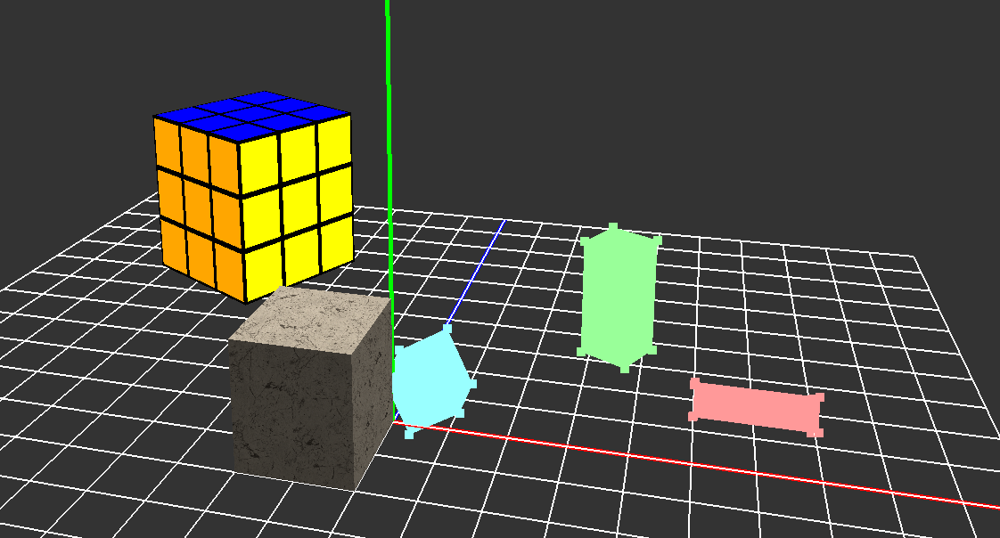
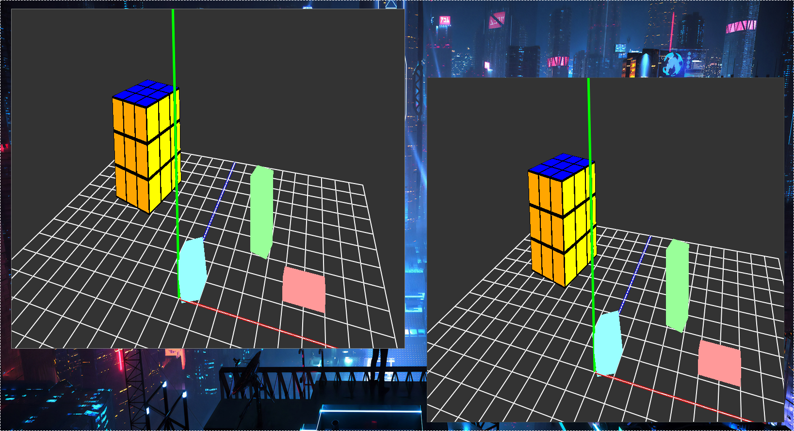

# Neon Engine

[](https://travis-ci.com/github/NeonSky/neon-engine)



### Support for multiple windows



## Getting Started

```
make setup
```

See Makefile for more commands.

## Points of Interest

* Test coverage: *./build/CODE_COVERAGE/index.html*
* Sphinx documentation: *./docs/_build/html/index.html*
* Doxygen documentation: *./docs/doxygen/html/index.html*
